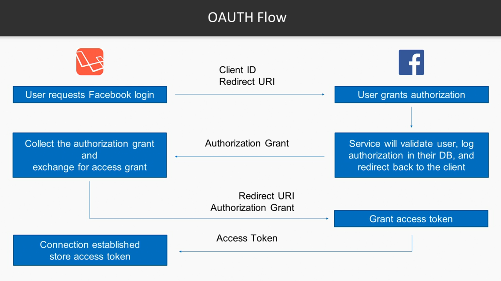

# Laravel-Socialite
Configuration and installation of Socialite

* In this Section, We are going to take a loot at ...
	* Configuration and Installing
	* How it WOrks?
	* Setting up facebook login
	*Login with twitter?
	* Other logins

* How Social Sign-on WOrks?
	* How does social sign-on work?
	* What is OAUTH?
	* What is necessary to log a user in via OAUTH

# WHat is OAuth
OAuth is the protocol that most social network use to authenticate users form other sites.

# Why OAuth
* The valet key for the web
* Allows social network access, without passing over creentials
* Can maintain different session lengths to the normal user
* Customizable access premissions
* User (or Service) can revoke access at anytime to our app

The Goal of OAuth flow
* Access_token is a randomly generated token that belongs only to our app and represents a user
* Our app will use this token for future requests where we want to interact with the service on behalf of this user
* This token is passed to the service which will then be used in place of the user's username and password

# Socialite controller and model setup
In this video, we are going to take a loot at ...
* Create a controller to manage our social networks
* Create a model to manage our social networks
* Setup a database relationship one-to-many to allow multiple social networks per account

# Logging in existing users and creating new ones
In this video, we are going to take a look at ...
* Create routes to manage our social login steps
* Redirect users back to the application after the user has granted access
* After the login process is complete (and we have an access token) we will either log any existing  user in, or create a new account if it's a new user